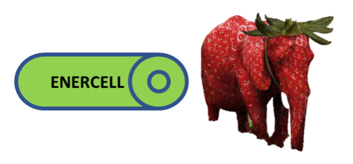

# ElectroNic ExeRcises for CiphEricaL Learning

This is the home of the ENERCELL project, which is devoted to developing simplified versions 
of post-quantum (a.k.a. quantum-safe) cryptographic algorithms suitable for classroom use.  (In the spirit of 
[S-DES](https://www.tandfonline.com/doi/abs/10.1080/0161-119691884799), 
[S-AES](https://www.tandfonline.com/doi/abs/10.1080/0161-110391891838), 
[Demitasse](http://www.rose-hulman.edu/%7Eholden/Preprints/stea-paper-revised.pdf), 
and [JHA](http://www.rose-hulman.edu/%7Eholden/Preprints/jha-paper.pdf).)

Currently available:
- [Alkaline](https://enercell.github.io/alkaline), a simplified version of Kyber (also suitable for powering very weak light-sabers)
	- Smeagol, a.k.a. Alkaline-LA, a version which requires only Linear Algebra (similar to Frodo)
	- Phantom, a.k.a. Alkaline-ALG, a version which requires only Abstract Algebra (similar to NewHope)

- [Lithium](https://enercell.github.io/lithium) (in development), a simplified version of Dilithium (also suitable for powering 
[very small starships](https://hitchhikers.fandom.com/wiki/List_of_races_and_species_in_The_Hitchhiker%27s_Guide_to_the_Galaxy#G'Gugvuntts_and_Vl'hurgs))

- Resource Guide for Teaching Post-Quantum Cryptography
	- [published version](https://www.tandfonline.com/doi/full/10.1080/01611194.2022.2078077)	
	- [preprint](https://arxiv.org/abs/2207.00558)
	

